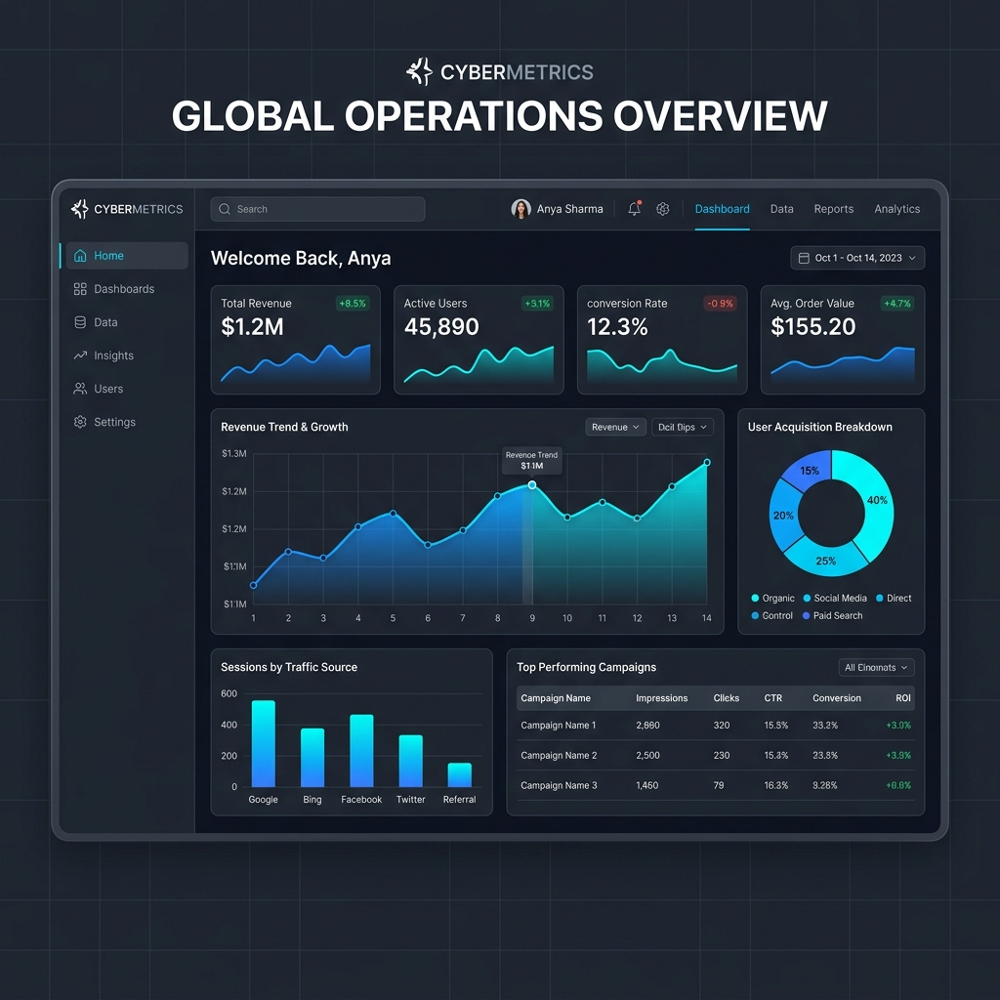

# 🚀 Premium Personal Portfolio | HIRTHICK M

A stunning, responsive, and visually optimized personal portfolio built with modern web standards. This project showcases the capabilities and professional journey of **HIRTHICK M**, a Software Engineer specializing in Web Development and Automation.



## ✨ Key Features

- **💎 Glassmorphic Design**: Clean, modern aesthetics with blurred translucent backgrounds and vibrant gradients.
- **📱 Fully Responsive**: Optimized for all devices—from desktop monitors to mobile phones.
- **✨ Smooth Scroll Navigation**: Seamless transitions between sections for an enhanced user experience.
- **📜 Education Timeline**: A stylish vertical timeline showcasing academic history.
- **💼 Project Gallery**: interactive interactive tiles displaying key works like **MedClinic AI**.
- **📩 Integrated Contact Info**: Professional contact section with links and direct email access.

## 🛠️ Tech Stack

- **Core**: HTML5, CSS3, Vanilla JavaScript (ES6+)
- **Typography**: Outfit & Inter (via Google Fonts)
- **Styling**: Modern CSS Grid & Flexbox, Backdrop filters, Animations
- **Assets**: Optimized PNG/WebP images and PDF integration

## 📂 Project Structure

```bash
├── assets/             # Images, mockups, and resume.pdf
├── index.html          # Main entry point and semantic structure
├── style.css           # Custom premium styling and animations
├── script.js           # Core interactivity and scroll effects
└── README.md           # Project documentation
```

## 🚀 Getting Started

1. **Clone the repository**:
   ```bash
   git clone https://github.com/Hirthick7/Codsoft_Portfolio.git
   ```
2. **Open the project**:
   Simply open `index.html` in any modern web browser.

## 👨‍💻 Author

**HIRTHICK M**
- 📧 [mhirthick07@gmail.com](mailto:mhirthick07@gmail.com)
- 🌐 [LinkedIn Profile](https://linkedin.com/in/hirthick-m)
- 📞 +91 8838542901

---
*Built with precision and passion for the Codsoft Portfolio challenge.*
